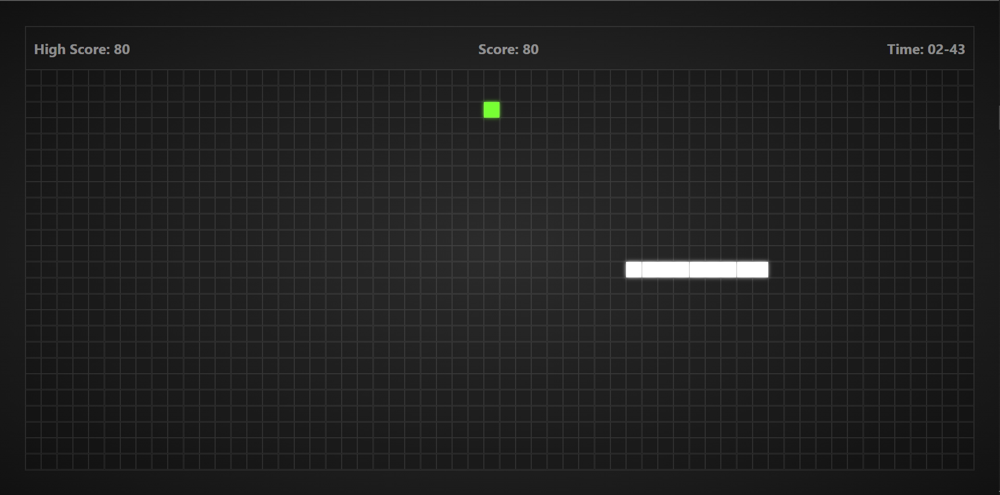
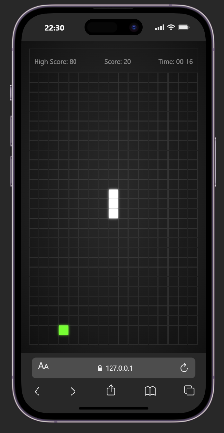

# 🐍 Snake Game

A modern and responsive Snake Game built with HTML5, CSS3, and Vanilla JavaScript. The game features score tracking, high score persistence using Local Storage, a timer system, and an interactive user interface.

## 🎮 Features

- Responsive game board
- Keyboard-controlled snake movement
- Food collection system
- Score tracking
- High score saved with Local Storage
- Game timer
- Start Game modal
- Game Over screen
- Restart functionality
- Clean and modern UI

## 🛠️ Technologies Used

- HTML5
- CSS3
- JavaScript (ES6)

## 📸 Preview




## 🚀 Live Demo

Play the game here:

(https://sherakram.github.io/snake-game/)

## 📂 Project Structure

```text
snake-game/
│
├── index.html
├── style.css
├── app.js
├── README.md
│
└── screenshots/
    └── preview.png
```

## ⚙️ Installation

Clone the repository:

```bash
git clone https://github.com/sherakram/snake-game.git
```

Navigate to the project folder:

```bash
cd snake-game
```

Open `index.html` in your browser.

## 🎯 Learning Objectives

This project was built to practice:

- DOM Manipulation
- Event Handling
- Game Logic Development
- JavaScript Timers
- Local Storage
- Responsive Design
- State Management

## 🔮 Future Improvements

- Self-collision detection
- Difficulty levels
- Pause and Resume functionality
- Sound effects
- Mobile touch controls
- Leaderboard system
- Dark/Light mode toggle

## 👨‍💻 Author

**Sheraz Akram**

GitHub: https://github.com/sherakram

---

If you found this project interesting, feel free to star the repository ⭐